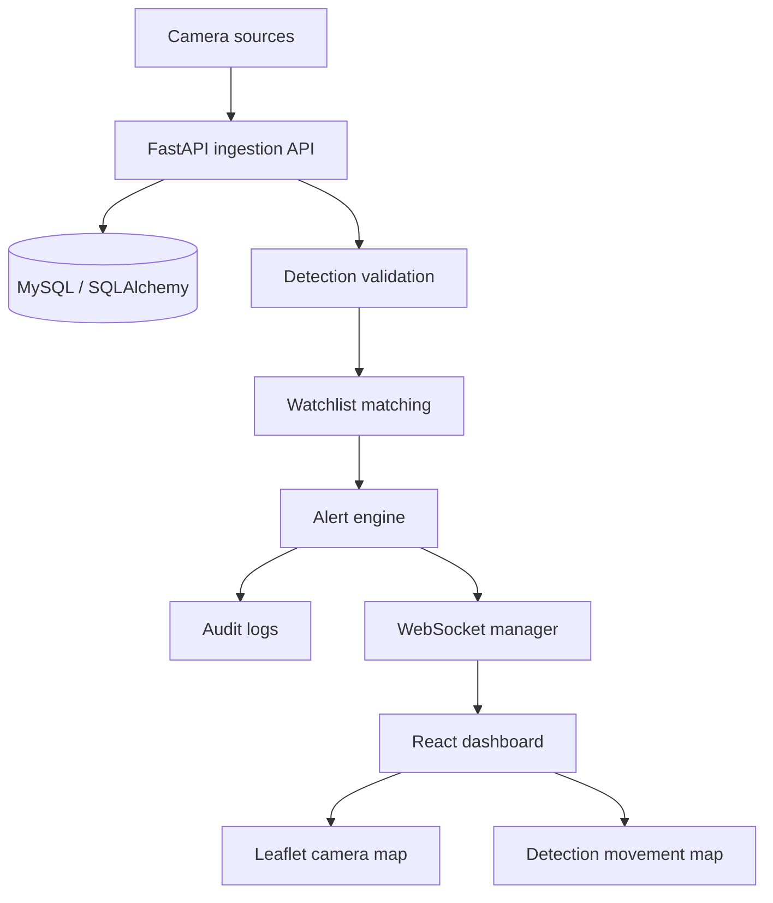

# Architecture

## Runtime flow

The React client authenticates through FastAPI and stores the returned access token in session storage. Axios sends the bearer token on protected requests. FastAPI routes call repositories and SQLAlchemy models through the database session dependency.

Detection ingestion performs the following steps:

1. Validate the event payload.
2. Resolve the external camera identifier.
3. Persist the detection.
4. Match the vehicle/entity identifier against active watchlist entries.
5. Persist an OPEN alert when a match exists.
6. Write an audit record.
7. Broadcast `DETECTION_CREATED` over the WebSocket.

Camera heartbeat writes the health state and broadcasts `CAMERA_HEALTH_CHANGED`. The dashboard consumes both event types and reconnects after an unexpected WebSocket close.

Alert acknowledgement and resolution broadcast `ALERT_UPDATED` with the complete alert record so connected dashboards can update without reloading.

## Components

- `backend/app/api`: HTTP and WebSocket routes.
- `backend/app/models`: SQLAlchemy persistence models.
- `backend/app/schemas`: Pydantic validation and response contracts.
- `backend/app/repositories`: database access operations.
- `backend/app/services`: cross-cutting services such as audit logging.
- `backend/app/websocket`: connection management and broadcasts.
- `frontend/src/pages`: authenticated workflows.
- `frontend/src/components/map`: camera and movement maps.
- `frontend/src/services`: Axios authentication/API and WebSocket clients.

## Source honesty

`SIMULATED` cameras render an animated test representation. `RECORDED` cameras render a playable MP4, WebM, or OGG URL when configured, otherwise they show `NO RECORDED SIGNAL`. RTSP, ONVIF, HLS, and WebRTC values are retained as protocol-ready source references and are not presented as active physical feeds by this prototype.
