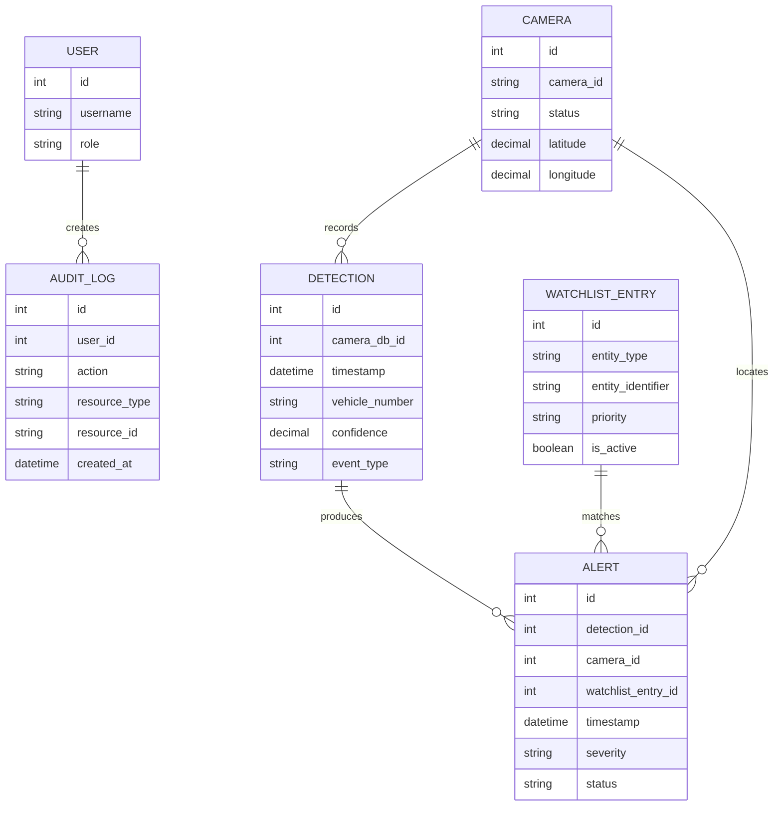

# Database and ER Model

The schema is managed with Alembic migrations in `backend/alembic/versions`.

Camera and watchlist identifiers are indexed. Detection searches are ordered by timestamp and scoped by optional camera, event, entity, and time filters. Alert status and watchlist activity are persisted fields rather than frontend-only state.

Historical migrations must not be rewritten. Any future schema change should be a new Alembic revision that preserves existing data.
